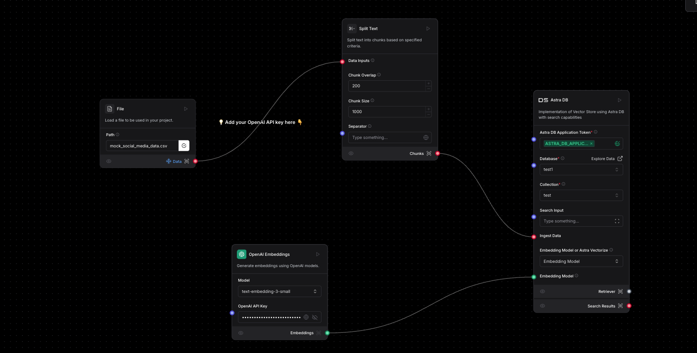

Levels Hackathon task project
# 📃 Team Astella
### 📲 Social Media Analytics Platform

## 🔍 Table of Contents
1. **🚀 Deployment**
2. **📊 Project Overview**
3. **💡 System Architecture**
4. **🛠️ Backend Implementation**
5. **💪 LangFlow Integration**
6. ** WorkFlow Diagram**

---

## 🚀 Deployment
### 🔗 Live Application
- **🏡 Production URL:** [https://teamastella.vercel.app/](https://teamastella.vercel.app/)
- **🛠️ Platform:** Vercel & Render
- **⚡ Status:** Active

### 🛠️ Deployment Infrastructure
- **🔍 Frontend:** Vercel
- **📊 Database:** DataStax Astra DB
- **🤖 AI Integration:** Langflow & OpenAI

---

## 📊 Project Overview
### 🌐 Objective
Develop an analytics module to analyze engagement data from mock social media accounts, leveraging Langflow and DataStax integration.

### 🔄 Core Components
- **📊 DataStax Astra DB** for database operations
- **💪 Langflow** for workflow creation and GPT integration
- **🔧 React-based frontend**
- **🛠️ Node.js backend**
- **🤖 OpenAI GPT integration**

### 🔍 Key Features
- ⏳ Real-time social media analytics
- 🤖 GPT-powered insights generation
- 🤞 AI-Powered Chat Bot
- 📈 Custom metric tracking
- 📊 Post performance analysis
- 🔢 Engagement metrics calculation

---

## 💡 System Architecture
### 🔍 Frontend Layer
#### 🌐 Landing Page
- **🔄 Header with navigation**
- **📚 Features showcase**
- **👨‍🎓 Team information**

### 🛠️ Backend Layer
- **🔗 WebSocket connections**
- **✉ Request handling**
- **🔄 Response streaming**
- **⚠ Error management**

#### 🔄 Data Processing
- **✉ Text splitting and chunking**
- **📈 Data parsing**
- **🔄 Vector store implementation**
- **🤖 GPT integration**

---


## 🛠️ Backend Implementation
### 🔧 Server Setup
```javascript
const express = require('express');
const http = require('http');
const WebSocket = require('ws');
const cors = require('cors');

const app = express();
const server = http.createServer(app);
const wss = new WebSocket.Server({ server });
```

### 🔄 WebSocket Management
- ✨ Unique `requestId` assignment
- 🔍 Connection tracking
- ⏳ Real-time data streaming
- ⚠ Error handling

### 🔢 API Endpoints
#### 🔗 Chat Endpoint
- 🔧 Handles client requests
- 🔗 Forwards to Langflow API
- 🔄 Streams responses
- ⚠ Error management

---

## 💪 LangFlow Integration
### 🔄 Pipeline Components
#### 📁 File Input
- **🔧 Loads JSON data**
- **🔗 Path:** `mock_social_media_data.json`

#### 🔢 Text Processing
- **✉ Chunk size:** 1000
- **🔄 Overlap:** 200
- **📚 Custom separators**

#### 📊 Astra DB Integration
- **🔢 Database:** `test1`
- **🔧 Collection:** `test`
- **🔄 Embedding Model:** `Astra Vectorize`
- **🔍 Provider:** OpenAI
- **🤖 Model:** `text-embedding-3-small`

#### 🤖 OpenAI Integration
- **🤖 Model:** `gpt-3.5`
- **⚡ Temperature:** 0.1
- **🔄 Streaming enabled**

## Workflow Diagram

Below is the visual representation of the RAG system workflow:

### Retriever


### Generator
